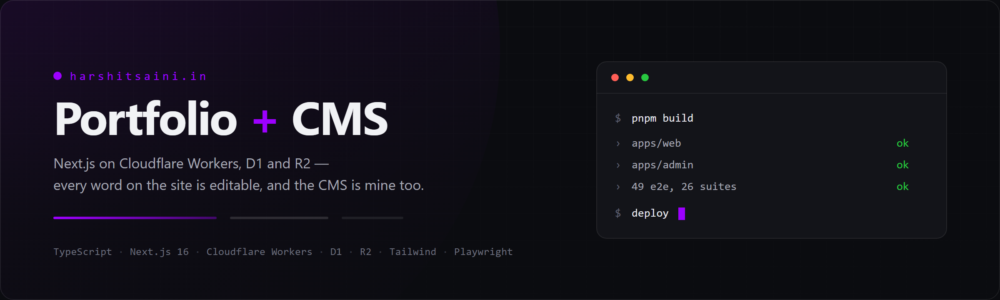

<p align="center">
  
</p>

<p align="center">
  <a href="https://harshitsaini.in">harshitsaini.in</a>
  &nbsp;·&nbsp;
  <a href="docs/PROJECT_STATE.md">Current state</a>
  &nbsp;·&nbsp;
  <a href="docs/DECISIONS.md">Decisions</a>
  &nbsp;·&nbsp;
  <a href="LICENSE">MIT</a>
</p>

---

A personal portfolio site and the admin CMS that fills it, as a pnpm monorepo.
Everything on the public site — copy, projects, skills, notes, section order,
the accent colour, even the lines the console prints — is a row in a database
that the CMS edits. There is no hardcoded content.

Both apps run on Cloudflare Workers via OpenNext, against D1 for data and R2
for media.

## What is actually built

| | |
| --- | --- |
| **Public site** | Live at [harshitsaini.in](https://harshitsaini.in) — hero, projects with case-study pages, experience, education, skills, tools, notes, a playground game, a terminal, and a contact form |
| **Admin CMS** | 19 areas — projects, skills, notes, media, the inbox, analytics, and on down to the robot's dialogue and the terminal's lines |
| **Auth** | The CMS's own login: password, then a six-digit code by email, with rate limiting, forgotten-password and change-password flows |
| **Data** | 19 migrations against Cloudflare D1, reached only through a repository layer |
| **Media** | Uploads to R2, through a storage seam that fails closed |
| **System screens** | Custom offline, 404, error and denied pages — each with its own game, mascot and CMS-controlled accent |

## Structure

```
apps/web          Public portfolio site (Next.js App Router, port 3000)
apps/admin        Admin CMS (Next.js App Router, port 3001)
packages/database Repository layer over D1 — the only way to the database
packages/schemas  Zod schemas; every external input is parsed by one
packages/types    Shared domain types
packages/ui       Shared components, design tokens and the theme module
packages/config   Shared tooling config (base tsconfig)
migrations/       D1 schema, applied in order
docs/             Documentation
e2e/              Playwright tests
```

## Prerequisites

- Node.js 24+
- pnpm 11+ (`corepack enable && corepack prepare pnpm@latest --activate`)

## Install

```bash
pnpm install
```

## Development

```bash
pnpm dev         # both apps in parallel
pnpm dev:web     # apps/web only,   http://localhost:3000
pnpm dev:admin   # apps/admin only, http://localhost:3001
```

Local data comes from a real workerd-backed D1 created by Wrangler's
`getPlatformProxy()` — the same database engine as production, never a mock.
Apply the schema with:

```bash
npx wrangler d1 execute portfolio-cms --local -c wrangler.d1.jsonc \
  --file migrations/0001_initial_schema.sql   # …then each one in order
```

## Quality commands

```bash
pnpm lint        # ESLint across the workspace
pnpm typecheck   # tsc --noEmit across the workspace
pnpm test        # 26 unit/integration suites
pnpm test:e2e    # 49 Playwright tests, desktop and phone
pnpm build       # production build of both apps
```

## Deploying

Deployment is a two-step sequence, and the order matters: **apply the
migration first**. Deploying ahead of a schema change takes the whole site
down with a 500, and `wrangler rollback` is not available.

```bash
# 1. Remote schema, from the repository root
npx wrangler d1 execute portfolio-cms --remote -c wrangler.d1.jsonc \
  --file migrations/00NN_whatever.sql

# 2. Then the Worker
./deploy.sh web
./deploy.sh admin
```

`deploy.sh` must run from Linux — OpenNext's bundling step recreates pnpm
symlinks, which Windows refuses without Developer Mode.

## Documentation

- [docs/PROJECT_STATE.md](docs/PROJECT_STATE.md) — what is done, with the measurements. The source of truth
- [docs/DECISIONS.md](docs/DECISIONS.md) — every architectural decision and why, including the ones that turned out wrong
- [docs/ARCHITECTURE.md](docs/ARCHITECTURE.md) — system structure
- [docs/DATABASE.md](docs/DATABASE.md) — the data model
- [docs/DESIGN.md](docs/DESIGN.md) — design system
- [docs/TESTING.md](docs/TESTING.md) — testing approach
- [docs/DEPLOYMENT.md](docs/DEPLOYMENT.md) — deployment, and which steps are a human's
- [docs/ROADMAP.md](docs/ROADMAP.md) — phase plan
- [docs/LEARNING.md](docs/LEARNING.md) — notes made while building
- [docs/CHANGELOG.md](docs/CHANGELOG.md) — dated change history

## Notes on how this is built

- **Accessibility is a requirement, not a pass at the end.** Semantic HTML,
  full keyboard operability, visible focus, WCAG AA contrast and
  `prefers-reduced-motion` throughout — checked by the e2e suite, which fails
  on a focus indicator below 3:1 or a tap target under 24px.
- **Content is data.** A string hardcoded in a component is a bug, not a
  shortcut.
- **One way in per resource.** The database is reached only through
  `packages/database`; R2 only through the storage seam. Both fail closed.
- **The docs record mistakes too.** `DECISIONS.md` keeps the reasoning that
  turned out wrong alongside the correction — a decision without its history
  gets made again.

## Licence

[MIT](LICENSE) © 2026 Harshit Saini.

The code is free to use. The content — the writing, the photographs, the CV —
is not; it is a description of a specific person.
